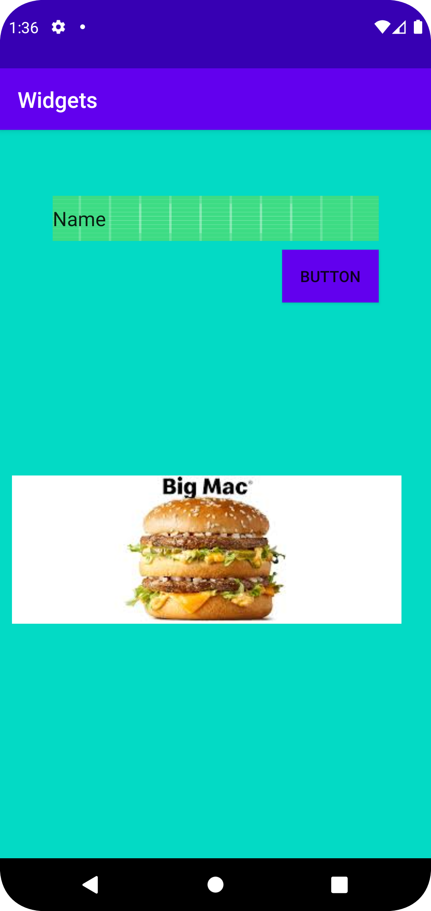

# Rapport

Jag har skapat en edittext , button och en imageview. Jag har använt margin i det här uppdraget
, färger har också används på button och edittext.


här är en del av mina koker som har använts under uppdraget
-
```

    <Button
        android:id="@+id/button2"
        android:layout_width="wrap_content"
        android:layout_height="wrap_content"
        android:layout_marginStart="256dp"
        android:layout_marginLeft="256dp"
        android:layout_marginTop="8dp"
        android:text="Button"
        android:background="@color/colorPrimary"
        app:layout_constraintEnd_toEndOf="@+id/editTextTextPersonName4"
        app:layout_constraintHorizontal_bias="1.0"
        app:layout_constraintStart_toStartOf="parent"
        app:layout_constraintTop_toBottomOf="@+id/editTextTextPersonName4" />

```

Bilder läggs i samma mapp som markdown-filen.


